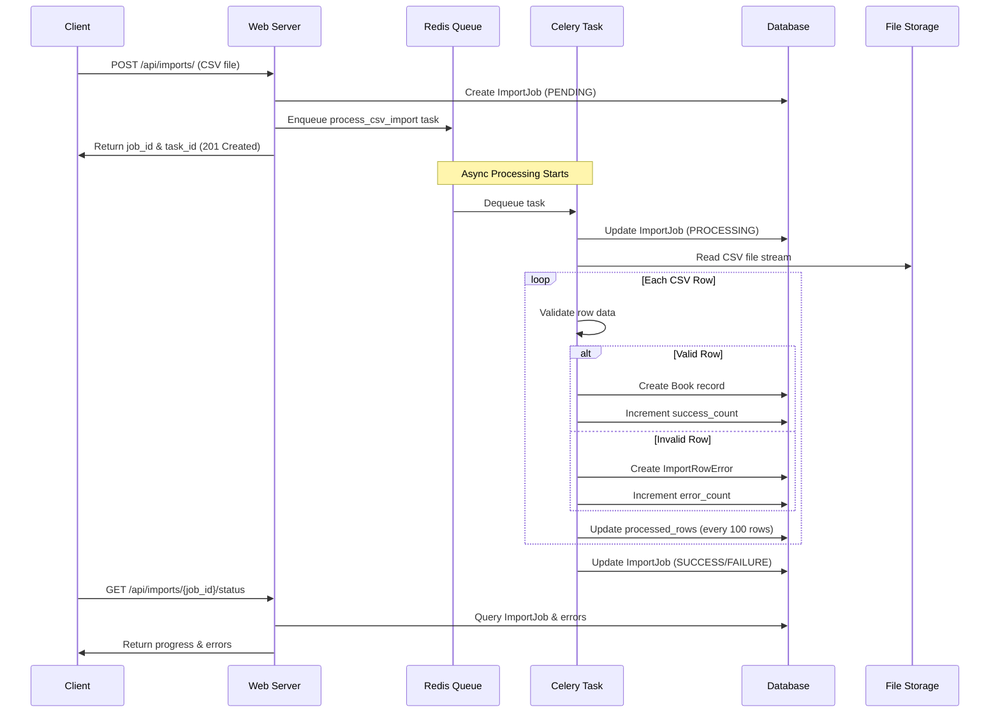

# Bibliflow - CSV Import System

A high-performance Django REST Framework system for asynchronous CSV file imports with real-time progress tracking and robust error handling.

## 🏗️ System Architecture

### High-Level Architecture
```
┌─────────────────┐    ┌──────────────────┐    ┌─────────────────┐
│   Client        │    │   Django Web     │    │   PostgreSQL    │
│   (Frontend)    │◄──►│   Application    │◄──►│   Database      │
│                 │    │                  │    │                 │
└─────────────────┘    └──────────────────┘    └─────────────────┘
                              │  ▲
                              │  │
                              ▼  │
┌─────────────────┐    ┌──────────────────┐
│   Redis         │◄──►│   Celery Worker   │
│   (Broker)      │    │   (Background     │
│                 │    │    Processing)    │
└─────────────────┘    └──────────────────┘
```

### Data Flow for CSV Import


## 🚀 Features

- **Asynchronous Processing**: CSV files processed in background using Celery
- **Real-time Progress Tracking**: Monitor import progress with percentage completion
- **Robust Error Handling**: Continue processing on row errors, don't stop entire import
- **Memory Efficient**: Stream processing for large files (>1GB+)
- **RESTful API**: Comprehensive API with Swagger documentation
- **Security**: File validation, authentication, and rate limiting ready
- **Monitoring**: Health checks, logging, and error tracking

## 🛠️ Technology Stack

| Layer | Technology |
|-------|------------|
| **Backend Framework** | Django 4.2 + Django REST Framework |
| **Async Processing** | Celery + Redis |
| **Database** | PostgreSQL 15 |
| **Containerization** | Docker + Docker Compose |
| **File Processing** | Python CSV module + Streaming |
| **Testing** | pytest + Factory Boy |
| **Monitoring** | Health checks + Structured logging |

## 📦 Installation

### Prerequisites
- Docker & Docker Compose
- Python 3.11 (for local development)

### Quick Start
```bash
# Clone the repository
git clone https://github.com/PeakPy/bibliflow.git
cd bibliflow

# Copy environment file
cp .env.example .env

# Start services
docker-compose -f compose/dev.yaml up --build

# Run migrations (in another terminal)
docker-compose -f compose/dev.yaml exec web python src/manage.py migrate

# Create superuser (optional)
docker-compose -f compose/dev.yaml exec web python src/manage.py createsuperuser
```

The application will be available at:
- Web: http://localhost:8000
- API Docs: http://localhost:8000/swagger/
- Admin: http://localhost:8000/admin/

## 🔧 Configuration

### Environment Variables
Key environment variables in `.env`:

```ini
# Database
DATABASE_URL=postgresql://bibliflow:password@db:5432/bibliflow_dev

# Redis
REDIS_URL=redis://redis:6379/0

# Security
SECRET_KEY=your-super-secret-key
ALLOWED_HOSTS=localhost,127.0.0.1

# File Processing
MAX_CSV_FILE_SIZE=104857600  # 100MB
DEFAULT_CHUNK_SIZE=100
```

## 📚 API Usage

### 1. Upload CSV File
```bash
curl -X POST http://localhost:8000/api/imports/ \
  -H "Authorization: Token your-token" \
  -F "file=@books.csv"
```

**Response:**
```json
{
  "job_id": "123e4567-e89b-12d3-a456-426614174000",
  "task_id": "celery-task-uuid",
  "status": "PENDING",
  "message": "File accepted. Processing started."
}
```

### 2. Check Import Status
```bash
curl -X GET http://localhost:8000/api/imports/123e4567-e89b-12d3-a456-426614174000/status/ \
  -H "Authorization: Token your-token"
```

**Response:**
```json
{
  "id": "123e4567-e89b-12d3-a456-426614174000",
  "filename": "books.csv",
  "status": "PROCESSING",
  "total_rows": 10000,
  "processed_rows": 2543,
  "success_count": 2520,
  "error_count": 23,
  "progress_percent": 25.43,
  "errors_preview": [
    {
      "row_number": 45,
      "error_message": "Duplicate ISBN: 1234567890",
      "raw_data": "Book Title,Author Name,1234567890,2020"
    }
  ]
}
```

### 3. Get Detailed Errors
```bash
curl -X GET http://localhost:8000/api/imports/123e4567-e89b-12d3-a456-426614174000/errors/ \
  -H "Authorization: Token your-token"
```

### CSV Format
Expected CSV format:
```csv
title,author,isbn,publication_year
The Great Gatsby,F. Scott Fitzgerald,9780743273565,1925
To Kill a Mockingbird,Harper Lee,9780061120084,1960
1984,George Orwell,9780451524935,1949
```

## 🧪 Testing

### Run Test Suite
```bash
# Run all tests
docker-compose -f compose/dev.yaml exec web pytest

# Run with coverage
docker-compose -f compose/dev.yaml exec web pytest --cov=.

# Run specific test module
docker-compose -f compose/dev.yaml exec web pytest tests/test_api.py -v
```

### Test Categories
- **Model Tests**: Data validation and business logic
- **API Tests**: Endpoint functionality and permissions
- **Task Tests**: Celery background job processing
- **Integration Tests**: Full import workflow

## 🔍 Monitoring & Debugging

### Health Checks
```bash
curl http://localhost:8000/health/
```

### View Celery Queue
```bash
# Check active workers
docker-compose -f compose/dev.yaml exec celery celery -A bibliflow inspect active

# Check task status
docker-compose -f compose/dev.yaml exec web python src/manage.py shell
>>> from apps.imports.models import ImportJob
>>> job = ImportJob.objects.get(id=1)
>>> print(job.status, job.progress_percent)
```

### Logs
```bash
# View application logs
docker-compose -f compose/dev.yaml logs web

# View Celery worker logs
docker-compose -f compose/dev.yaml logs celery

# View database logs
docker-compose -f compose/dev.yaml logs db
```

## 🗃️ Database Schema

### Core Tables
```sql
books
├── id (UUID, PK)
├── title (VARCHAR)
├── author (VARCHAR)
├── isbn (VARCHAR, UNIQUE)
├── publication_year (INTEGER)
└── timestamps (created_at, updated_at)

import_jobs
├── id (UUID, PK)
├── filename (VARCHAR)
├── status (ENUM: PENDING, PROCESSING, SUCCESS, FAILURE)
├── progress_metrics (total_rows, processed_rows, success_count, error_count)
├── celery_task_id (VARCHAR)
└── timestamps (created_at, started_at, finished_at)

import_row_errors
├── id (UUID, PK)
├── import_job_id (FK to import_jobs)
├── row_number (INTEGER)
├── raw_data (TEXT)
├── error_message (TEXT)
└── created_at (TIMESTAMPTZ)
```

## 🚨 Error Handling

The system handles various error scenarios:

| Error Type | Handling Strategy |
|------------|-------------------|
| **Invalid CSV Format** | Reject upload with descriptive error |
| **Duplicate ISBN** | Skip row, record error, continue processing |
| **Missing Required Fields** | Skip row, record error, continue processing |
| **Database Connection Loss** | Retry with exponential backoff (max 3 attempts) |
| **File Too Large** | Reject upload (configurable limit) |
| **Memory Overflow** | Stream processing prevents OOM errors |

## 🔄 Deployment

### Production Setup
```bash
# Use production configuration
docker-compose -f compose/prod.yaml up -d

# Run migrations
docker-compose -f compose/prod.yaml exec web python src/manage.py migrate

# Collect static files
docker-compose -f compose/prod.yaml exec web python src/manage.py collectstatic --noinput
```

### Environment Checklist
- [ ] Set `DEBUG=False`
- [ ] Configure proper `ALLOWED_HOSTS`
- [ ] Set strong `SECRET_KEY`
- [ ] Configure production database
- [ ] Set up SSL/HTTPS
- [ ] Configure monitoring and alerts

## 🤝 Development

### Project Structure
```
bibliflow/
├── src/
│   ├── apps/
│   │   ├── books/          # Book data model and API
│   │   ├── imports/        # CSV import functionality
│   │   └── core/           # Shared utilities
│   ├── bibliflow/          # Django project settings
│   └── manage.py
├── docker/                 # Docker configurations
├── compose/               # Docker Compose files
├── scripts/               # Entrypoint and utility scripts
└── tests/                 # Comprehensive test suite
```

### Code Standards
- Follow Django and DRF best practices
- Use type hints for better code clarity
- Write comprehensive tests for new features
- Maintain API documentation
- Use meaningful commit messages

## 📈 Performance

- **File Processing**: Stream-based, handles files >1GB
- **Database**: Optimized indexes and bulk operations
- **Memory**: Constant memory usage regardless of file size
- **Concurrency**: Celery worker scaling for multiple imports
- **Caching**: Redis for progress tracking and result caching

## 🆘 Troubleshooting

### Common Issues

**Import stuck in PENDING state:**
```bash
# Check Celery worker status
docker-compose -f compose/dev.yaml exec celery celery -A bibliflow status

# Restart Celery worker
docker-compose -f compose/dev.yaml restart celery
```

**Database connection errors:**
```bash
# Check database health
docker-compose -f compose/dev.yaml exec db pg_isready

# View database logs
docker-compose -f compose/dev.yaml logs db
```

**File upload fails:**
- Check `MAX_CSV_FILE_SIZE` in environment variables
- Verify file is valid CSV format
- Check storage directory permissions

## 📄 License

This project is licensed under the MIT License - see the LICENSE file for details.

## 👥 Contributing

1. Fork the repository
2. Create a feature branch (`git checkout -b feature/amazing-feature`)
3. Commit your changes (`git commit -m 'Add amazing feature'`)
4. Push to the branch (`git push origin feature/amazing-feature`)
5. Open a Pull Request
